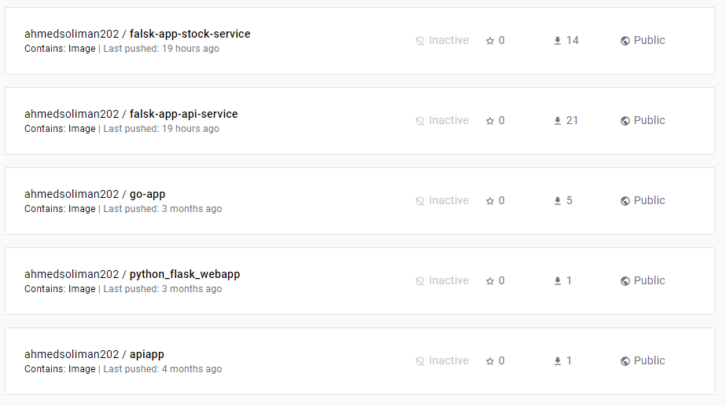
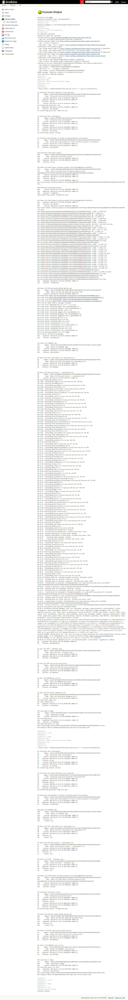

<div align="center">
    
</div>

# Table of content
1. [Flask Challenge](#req)
    - [Description](#desc)    
    - [Assignment](#Asmnt)
2. [Minimum requirements](#min_req)
    - [API service](#api_svc)    
    - [Stock service](#stock_svc)    
3. [Architecture](#arct)
4. [Bonuses](#bons)
5. [Phase 1 ( How to run the project Locally)](#local)
6. [Phase 2 ( Containerizing the api-service and stock-service apps Using Docker)](#docker)
7. [Phase 3 ( Building CI to push the api-service and stock-service apps to dockerhub using Jenkins)](#jenkins)
8. [Phase 4 ( Deploying the api-service and stock-service apps with Kubernetes)](#Kubernetes)
9. [Phase 5 ( Deploying the api-service and stock-service apps with Helm Charts)](#helm)
10. [Phase 6 ( Building CD of the api-service and stock-service apps Using ArgoCD and Helm Charts)](#argocd)
11. [Phase 7 ( How to test the apps )](#remote)
12. [Time for some Screen Shots](#screen_shots)

## Flask Challenge <a name="req"></a>

## Description <a name="desc"></a>
This project is designed to test your knowledge of back-end web technologies, specifically in the Flask framework, Rest APIs, and decoupled services (microservices).

## Assignment <a name="Asmnt"></a>
The goal of this exercise is to create a simple API using Flask to allow users to query [stock quotes](https://www.investopedia.com/terms/s/stockquote.asp).

The project consists of two separate services:
* A user-facing API that will receive requests from registered users asking for quote information.
* An internal stock aggregator service that queries external APIs to retrieve the requested quote information.

For simplicity, both services will share the same dependencies (requirements.txt) and can be run from the same virtualenv, but remember that they are still separate processes.

## Minimum requirements <a name="min_req"></a>
### API service <a name="api_svc"></a>
* Endpoints in the API service should require authentication (no anonymous requests should be allowed). Each request should be authenticated via Basic Authentication.
You have to implement the code to check the user credentials are correct and put the right decorators around resource methods (check the auth.helpers module).
* When a user makes a request to get a stock quote (calls the stock endpoint in the api service), if a stock is found, it should be saved in the database associated to the user making the request.
* The response returned by the API service should be like this:

  `GET /stock?q=aapl.us`
  ```
    {
    "symbol": "AAPL.US",
    "company_name": "APPLE",
    "quote": 123
    }
  ```
  The quote value should be taken from the `close` field returned by the stock service.
* A user can get his history of queries made to the api service by hitting the history endpoint. The endpoint should return the list of entries saved in the database, showing the latest entries first:
  
  `GET /history`
  ```
  [
      {"date": "2021-04-01T19:20:30Z", "name": "APPLE", "symbol": "AAPL.US", "open": "123.66", "high": 123.66, "low": 122.49, "close": "123"},
      {"date": "2021-03-25T11:10:55Z", "name": "APPLE", "symbol": "AAPL.US", "open": "121.10", "high": 123.66, "low": 122, "close": "122"},
      ...
  ]
  ```
* A super user (and only super users) can hit the stats endpoint, which will return the top 5 most requested stocks:

  `GET /stats`
  ```
  [
      {"stock": "aapl.us", "times_requested": 5},
      {"stock": "msft.us", "times_requested": 2},
      ...
  ]
  ```
* All endpoint responses should be in JSON format.

### Stock service <a name="stock_svc"></a>
* Assume this is an internal service, so requests to endpoints in this service don't need to be authenticated.
* When a stock request is received, this service should query an external API to get the stock information. For this challege, use this API: `https://stooq.com/q/l/?s={stock_code}&f=sd2t2ohlcvn&h&e=csv`.
* Note that `{stock_code}` above is a parameter that should be replaced with the requested stock code.
* You can see a list of available stock codes here: https://stooq.com/t/?i=518

## Architecture <a name="arct"></a>

1. A user makes a request asking for Apple's current Stock quote: `GET /stock?q=aapl.us`
2. The API service calls the stock service to retrieve the requested stock information
3. The stock service delegates the call to the external API, parses the response, and returns the information back to the API service.
4. The API service saves the response from the stock service in the database.
5. The data is formatted and returned to the user.

## Bonuses <a name="bons"></a>
The following features are optional to implement, but if you do, you'll be ranked higher in our evaluation process.
* Add unit tests for the bot and the main app.
* Connect the two services via RabbitMQ instead of doing http calls.
* Use JWT instead of basic authentication for endpoints.

## Phase 1 ( How to run the project Locally ) <a name="how_to_run"></a>
- Create virual environment and install dependencies
  * Create a virtualenv: `python -m venv virtualenv`
  * Activate the virual environment :
    - On Unix based OS `. virtualenv/bin/activate` or `source virtualenv/bin/activate`
    - On Windwos based OS `. virtualenv/Scripts/activate` or `source virtualenv/Scripts/activate`
  * Install dependencies: `pip install -r requirements.txt`
- Start the api service
  * Change working directory to api service : `cd api_service`
  * Create Database and it's tables and intial users : `python manage.py init`
  * Start the api service: `flask run`
- Start the api service
  * Change working directory to stock service : `cd stock_service`
  * Start the stock service: `flask run`

## Phase 2 ( containerizing the api-service and stock-service apps Using Docker)<a name="docker"></a>

- Make sure to have Docker installed using their [official website](https://docs.docker.com/get-docker/)
- My first attempt was successful in creating, building and testing a docker image for the the api-service and stock-service apps but I think the size can be reduced
- So as a bonus I was planing to use of the [Distroless images](https://github.com/GoogleContainerTools/distroless) and reduced the size of the docker images but didn't have the time to do so.

    - You can build a docker image using this command and tag it using the `-t`
        ```bash
        docker build -f ./api-service/Dockerfile -t api-service:latest .
        ```
	- After building the `api-service` image it is time to test it as following exposing `port 5000`
        ```bash
        docker run -d -p 5000:5000 --name api-service api-service:latest
        ```


- Wrote a `docker-compose.yml` manifest to eaisly spin up the api-service app and the stock-service app all together with one command

    - docker-compose doesn't come installed with Docker so you have to install it manually from [here](https://docs.docker.com/compose/install/standalone/)
    - You can run a docker compose file using the following command
        ```bash
        docker-compose up
        ```
- Side Note: 
    - I used -f with `docker build` to specifiy the location of Dockerfile and `.` to specify the location which includes the files Dockerfile deals with
      - if I didn't use the `-f` flag I won't have been able to copy the `requiremnets.txt` from the parent directory

## Phase 3 ( building CI to push the api-service and stock-service apps to dockerhub using Jenkins)<a name="jenkins"></a>

- Make sure to have Jenkins installed using [their website here](https://www.jenkins.io/doc/book/installing/) .

- You have to rename the docker image to include you dockerhub username

    - You can rename a docker image using this command
    ```bash
    docker tag api-service:latest ahmedsoliman202/api-service:latest
    ```
    - You can push a docker image to dockerhub using this command
    ```bash
    docker push ahmedsoliman202/api-service:latest
    ```
- Created image can be found here [api-service:latest](https://hub.docker.com/repository/docker/ahmedsoliman202/falsk-app-api-service)
- Side Note: 
    - in order to use Jenkins to build and push docker images the host pc must have docker installed and in my case I accessed the Jenkins container and mounted docker socket volume into the Jenkins container to enable the execution of Docker commands on the host machine

## Phase 4 ( deploying the api-service and stock-service apps with Kubernetes)<a name="Kubernetes"></a>

- Make sure you have `kubectl`,`minikube` installed from the [Kubernetes docs](https://kubernetes.io/docs/tasks/tools/)

    - You also must have a `minikube driver` installed, in my case I used `Virtual box`
    - In order to interact with the minikube cluster you have have to start it using this command
        ```bash
        minikube start --driver=virtualbox
        ```
-  We can deploy the api-service and stock-service apps kubernetes manifest using this command

    ```bash
     kubectl create -f ./kubernetes/api-service-deployment.yaml
     kubectl create -f ./kubernetes/stock-service-deployment.yaml
    ````
    - To see if the pod was created successfully and running using this command to list all the pods in a cluster node
        ```bash
        kubectl get pods
        ```
- I defined a k8 `Service` resource in `app-deployment.yaml` of type `NodePort` so that I can Expose the api-service and stock-service apps to the public

    - In order to access the api-service and stock-service apps publicly, We have to get the cluster ip using this command
        ```bash
        minikube ip
        ```
    - I have set the `NodePort` to `30008` so we can use the cluster ip along with the nodeport to test the app, The url will be something like `http://192.168.197.128:30008`

    - Another way to do it is though minikube and that should open the url directly in the browser:
        ```bash
        minikube service api-service-svc
        ```


- Side Note: 
    - I have defined the `replicas` in the `app-deployment.yaml` to achieve high availability of the service.

## Phase 5 ( deploying the api-service and stock-service apps with Helm Charts)<a name="helm"></a>

- Make sure to have Helm installed from [official docs](https://helm.sh/docs/intro/install/).

- You can create a `Helm Chart` using this command 
    ```bash
    helm create chartnamehere
    ```
- You can verify the helm charts before deploying by generating the template using this command
    ```bash
    helm template --output-dir ./charts-test-templates --values=./helm_charts/api-service/values.yaml ./helm_charts/api-service/
    ```
- Like we did in kubernetes, We will deploy the api-service app using this command
    ```bash
    helm install api-service --values=./helm_charts/api-service/values.yaml ./helm_charts/api-service/
    ```
- And we deploy stock-service app using this command
    ```bash
    helm install stock-service --values=./helm_charts/stock-service/values.yaml ./helm_charts/stock-service/
    ```
- Side Note:
    - I have defined a `HorizontalPodAutoscaler` resource in `hpa.yaml` to achieve autoscaling and high availability of the service. 

## Phase 6 ( building CD of the api-service and stock-service apps Using ArgoCD and Helm Charts)<a name="argocd"></a>

- First thing to do before installing Argocd is to create a kubernete namespace using this command 
    ```bash
    kubectl create namespace argocd
    ```
- Make sure to have ArgoCD installed from [official docs](https://argo-cd.readthedocs.io/en/stable/getting_started/).

    - You can get the Url where Argocd is hosted, it will be something like `http://192.168.197.128:30196` by using this command
        ```bash
        minikube service argocd-server -n argocd --url
        ```

        - I encountered this error `service argocd/argocd-server has no node port`
        and found the solution here [access-argocd-server](https://stackoverflow.com/questions/67262769/access-argocd-server)
        which is as follows :
        ```bash
        kubectl patch svc argocd-server -n argocd -p '{"spec": {"type": "NodePort"}}' 
        ```

    - Default username is `admin` and the password can be loacated using this command
        ```bash
        kubectl -n argocd get secret argocd-initial-admin-secret -o jsonpath='{.data.password}' | base64 -
        ```
- To interact with Argocd, You have to install ArgoCD CLI:
    - from [ArgoCD CLI official docs](https://argo-cd.readthedocs.io/en/stable/getting_started/)
    - Or you can download the release from their [github release page](https://github.com/argoproj/argo-cd/releases) and make sure the version you installed matches the release version.
    - After installing argocd cli, You need to login because the cli doesn't know where to find the instance running argocd
        - Once Argocd Cli is installed, We login to Argocd using the service url which we can get using this command :
        ```bash
        minikube service argocd-server -n argocd
        ```
        and then use the IP (HTTP or HTTPS) in the following command to access the ArgoCD UI
        ```bash
        argocd login IP of the argocd service
        ```
        - A good place to find reliable examples on how to use the CLi, creating applications, Using UI, can be found [Offcial Docs](https://argo-cd.readthedocs.io/en/stable/getting_started/)

- Like we did in kubernetes & Helm We will deploy the api-service app using this command
    ```bash
    argocd app create -f ./argocd_files/api-service-mainfest.yaml
    ```
- Then we deploy stock-service app through Argocd Cli using this command 
    ```bash
    argocd app create -f ./argocd_files/stock-service-mainfest.yam
    ```
- We can access the api-service app, it will be something like `http://192.168.197.128:30008` using this command
    ```bash
    minikube service go-app-svc -n argocd --url
    ```
- Side Note:
    - If you are using windows, make sure to rename the downloaded argocd cli from `argocd-windows-amd64.exe` to `argocd.exe`
    - Aslo make sure to add `argocd.exe` location to windows environment variable `path`


## Phase 7 ( How to test the api-service and stock-service apps )<a name="remote"></a>

- I'm hosting the containerized api-service and stock-service apps on an AWS EC2 instatnce.
- Api-service app endpoints can be accessed through these URLs:
    ```bash
    http://3.144.209.223:5000/api/v1/login
    http://3.144.209.223:5000/api/v1/stock?q=aapl.us
    http://3.144.209.223:5000/api/v1/users/history
    http://3.144.209.223:5000/api/v1/stats
    ```

- Stock-service app endpoint can be accessed through this URL:
    ```bash
    http://3.144.209.223:5001/api/v1//stock?q=aapl.us
    ```

## Time for some Screen Shots <a name="screen_shots"></a>
- Running the api-service app locally and testing /login GET endpoint with admin user credintials

- Running the api-service app locally and /login GET endpoint with normal user credintials

- Running the api-service app locally and /login GET endpoint with wrong credintials

- Running the api-service app locally and testing stock retrival /stock?q=aapl.us GET endpoint

- Running the api-service app locally and testing users history /users/history GET endpoint

- Running the api-service app locally and testing admin user accessing stats /stats GET endpoint

- Running the api-service app locally and testing normal user accessing stats /stats GET endpoint

- Running the stock-service app locally and testing stock retrival /stock?q=aapl.us GET endpoint

- Building a Docker image and Running api-service container

- Building a Docker image and Running api-service container

- Docker image repo on Dockerhub

- Running Jenkins stages to build and push the docker image to Dockerhub

- Jenkins successfully built and pushed the docker image to Dockerhub

